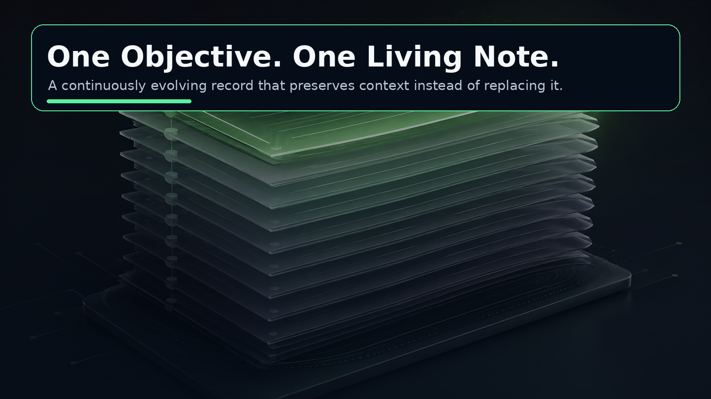
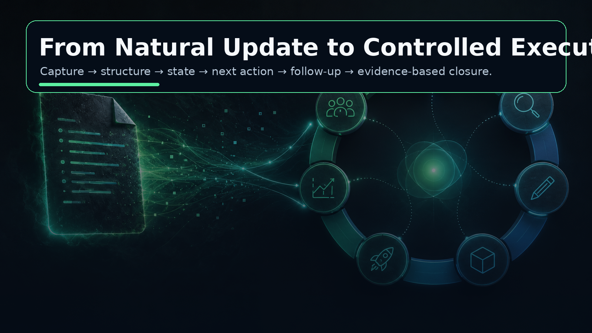
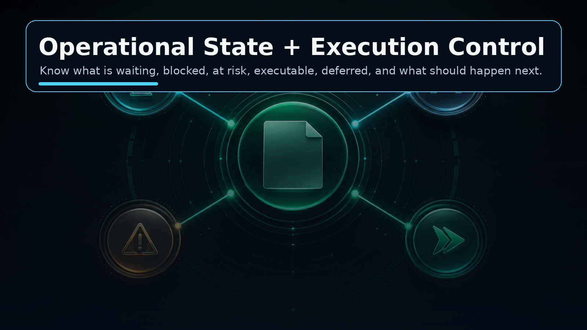
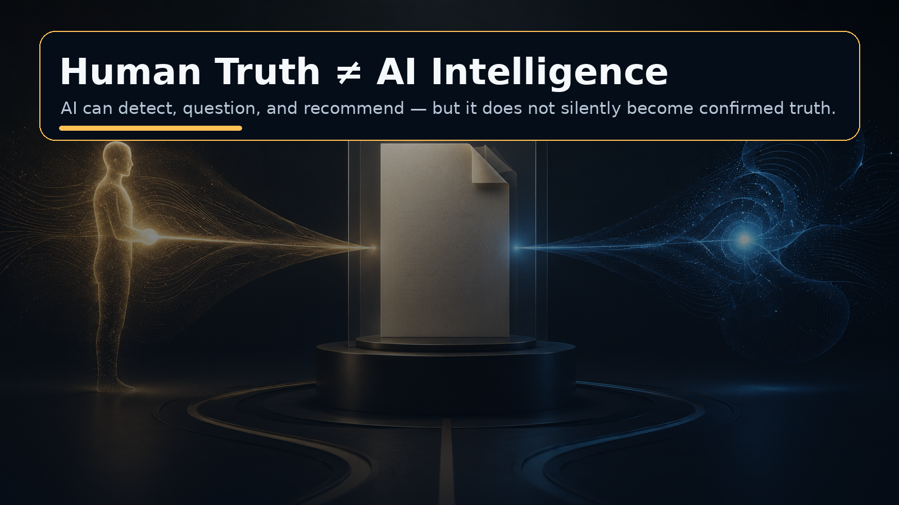
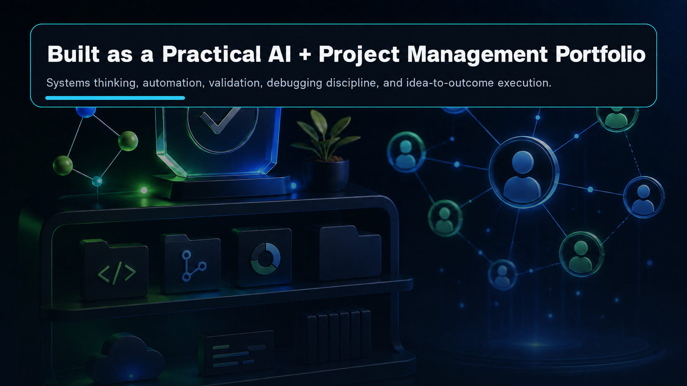

# Objective Lifecycle Engine

> **One Objective. One Living Note. Always in Control.**

An AI-assisted, human-controlled objective management system designed to turn natural-language updates into a continuously maintained **operational record**.

Instead of scattering one objective across tasks, chats, daily notes, status trackers, and memory, the Objective Lifecycle Engine keeps the objective in **one living Markdown note** that evolves as the work evolves.



---

## The problem I wanted to solve

Most productivity tools are good at recording tasks.

Real execution is harder.

An objective can become difficult to manage when:

- updates are scattered across different places;
- the real **Current Next Action** becomes unclear;
- work is waiting on another person, approval, system, or dependency;
- blockers and risks appear after execution has already started;
- completed actions continue to look like pending actions;
- future actions are shown as actionable even though their prerequisites are not complete;
- AI recommendations become mixed with facts;
- newer updates overwrite older context;
- an objective looks “active” without explaining whether it is healthy, waiting, blocked, or at risk.

I wanted a system that does more than store notes.

I wanted the note itself to behave like an **operating record for the objective**.

---

## Objective

Build a local-first Objective Lifecycle Engine that helps a human move an objective from intention to verified completion while continuously maintaining:

- what the objective is;
- what has already happened;
- what is currently true;
- what remains unresolved;
- what is waiting;
- what is blocked;
- what depends on something else;
- what action can actually be executed now;
- what may require attention;
- what evidence is still required before closure.

The user should be able to speak or type naturally while the system maintains the structure.

---

## Core idea

### One objective = one living note

The system does **not** create a new note every time something changes.

The same objective note is continuously updated.

Historical updates remain append-only.

That creates a single place where the objective can be understood from beginning to end.

---

## How the concept works

```text
Natural human update
        ↓
Semantic structuring
        ↓
Living objective note
        ↓
Operational state
        ↓
Execution controls
        ↓
Truth-safe AI intelligence
        ↓
Human decision / action
        ↓
Append-only objective journey
        ↓
Definition of Done
        ↓
Human-confirmed closure
```



---

## Key capabilities

### 1. Living Objective Record

Every objective is maintained as one persistent Markdown note.

The note keeps:

- the objective;
- structured context;
- Definition of Done;
- current execution state;
- current next action;
- unresolved controls;
- AI observations;
- complete update history;
- raw human input.

New updates extend the story instead of replacing it.

---

### 2. Append-only history

A later update must never erase an earlier update.

The Objective Journey preserves the sequence of what happened over time, including changes in state and earlier AI observations.

This makes the system useful for:

- project review;
- auditability;
- retrospectives;
- decision traceability;
- lessons learned;
- restarting work after a gap.

---

### 3. Operational State

An objective can be active while being in very different conditions.

The engine distinguishes execution conditions such as:

- **Ready**
- **In Progress**
- **Waiting**
- **Blocked**
- **At Risk**
- **Review Needed**

This is separate from completion status.



---

### 4. Execution Controls

The engine distinguishes between the objective's overall state and the action that can be executed now.

It maintains:

- **Current Next Action**
- **Next Action Status**
- **Waiting On**
- **Dependencies**
- **Blockers**
- **Deferred Action**

A future step is not treated as executable merely because it appears later in a sentence.

Example:

```text
I am waiting for customer approval.
After approval I will release the drawing.
```

The system can represent:

```text
State: waiting
Waiting On: customer approval
Dependency: customer approval
Deferred Action: release the drawing
Current Next Action: none
```

If a real follow-up action is available:

```text
Tomorrow I will follow up with the customer.
```

then the objective may still be **waiting**, while the Current Next Action is **executable**.

That distinction is important in real project work.

---

### 5. Human Truth vs AI Intelligence

AI is useful for analysis, but an AI guess should not silently become a fact.

The engine therefore separates:

```text
Human Truth
≠
AI Intelligence
```

AI may surface:

- risk candidates;
- blocker candidates;
- dependency candidates;
- contradictions;
- missing information;
- pending decisions;
- suggested next actions;
- mitigation suggestions.

But AI Intelligence remains visibly **unconfirmed**.

It does not silently:

- create confirmed decisions;
- rewrite factual history;
- change Definition of Done;
- mark completion;
- close the objective.



---

### 6. Human-controlled Definition of Done

AI can help structure an initial Definition of Done.

But completion is not automatic.

The human remains responsible for:

- checking completion evidence;
- deciding whether the DoD is truly satisfied;
- confirming final closure.

This keeps the system useful for decision support without turning it into autonomous authority.

---

## Typical user workflow

### Capture

Speak or type the objective naturally.

### Structure

The engine converts the input into a structured objective note.

### Execute

The note maintains current state, unresolved controls, and Current Next Action.

### Continue

When reality changes, update the same objective in natural language.

### Detect

Deterministic rules and advisory AI identify inconsistencies, missing information, risks, dependencies, or decision needs.

### Act

The human decides what to do.

### Preserve

Every update stays in the Objective Journey.

### Close

The objective closes only after its Definition of Done is satisfied and the human confirms completion.

---

## Why the existing approach was insufficient

A normal task list can tell me:

> “Release drawing.”

But real execution may actually be:

```text
Waiting for approval
        ↓
Follow up with customer
        ↓
Approval received
        ↓
Release drawing
```

The difference is the **lifecycle context**.

The Objective Lifecycle Engine is designed to preserve that context continuously.

---

## Where this concept can be useful

The same lifecycle model can support:

- project management;
- technical coordination;
- procurement/vendor follow-up;
- business development;
- job search;
- learning objectives;
- personal projects;
- event planning;
- issue resolution;
- administrative work;
- recurring professional objectives.

The domain can change.

The lifecycle pattern remains similar:

```text
Objective
→ Action
→ Update
→ Waiting / Dependency / Risk / Blocker
→ Decision
→ Next Action
→ Evidence
→ Closure
```

---

## Validation approach

I deliberately treated validation as part of the product design rather than an afterthought.

The current build has been exercised through:

- **110+ automated lifecycle and regression checks**;
- semantic stress testing across multiple objective profiles;
- AI intelligence stress testing;
- repeated real-note continuation tests;
- append-only history tests;
- operational state transition tests;
- waiting/dependency/blocker resolution tests;
- targeted debugging using real failed note outputs.

Latest acceptance evidence included:

- **Semantic Stress: 41/42 checks = 97.6%**
- **Zero timeouts**
- separate AI Intelligence stress testing above the acceptance threshold
- successful dependency and blocker cleanup after resolution.

The goal is not to prove that AI is perfect.

The goal is to build a system whose **overall behavior remains reliable even when model outputs vary**.

---

## System thinking behind the project

Several principles guided the design:

### Deterministic logic before AI where possible

If code can safely determine something, the model should not be asked to guess it.

### Human truth remains authoritative

AI advises.

The human owns facts, decisions, completion evidence, and closure.

### History is permanent

Current state may change.

Historical truth should not disappear.

### Current action must be executable

A future action blocked by a prerequisite belongs in Deferred Action, not Current Next Action.

### Local-first data

Markdown remains the permanent record.

The interface and AI layer can evolve without locking the objective history into a proprietary data store.

---

## What I learned from building it

This project pushed me beyond simply “using an AI API.”

It required thinking about:

- state machines;
- human-in-the-loop AI;
- structured natural-language extraction;
- deterministic validation;
- prompt boundaries;
- local-first data design;
- append-only history;
- regression testing;
- semantic testing;
- debugging from real user evidence;
- project lifecycle thinking;
- UX friction;
- AI reliability vs deterministic control.

The most important lesson:

> **Useful AI systems need boundaries, state, evidence, and human authority — not only a good prompt.**

---

## Outcome

The result is a working foundation for an **AI-assisted Objective Operating System**.

Instead of manually maintaining multiple trackers, the intended interaction becomes:

> **Talk naturally → let the engine maintain state → inspect what deserves attention → decide → execute → update → close with evidence.**



---

## Future direction

The concept can be extended further toward:

- attention-oriented objective dashboards;
- stronger closure and lessons-learned workflows;
- migration and production-hardening tools;
- richer time tracking;
- calendar scheduling;
- proactive overdue / running-out-of-time alerts;
- Android reminder notifications;
- deeper integration with a personal Annual Planner operating system.

These are future extensions of the same core principle:

> **The human works naturally. The system maintains operational clarity.**

---

## Why I am sharing this

I am using this project as a practical proof of work across:

- AI-assisted project management;
- workflow automation;
- systems thinking;
- local-first productivity tooling;
- project management discipline;
- testing and debugging;
- idea-to-outcome development.

I am especially interested in connecting with people working on:

- AI productivity systems;
- project / PMO automation;
- human-in-the-loop agents;
- local-first software;
- Obsidian workflows;
- practical AI for professional work.

---

## Public portfolio note

This repository intentionally focuses on the **problem, concept, workflow, capabilities, validation, and outcome**.

Private implementation details, credentials, API keys, and sensitive code/configuration are not included.

---

### One Objective. One Living Note. Always in Control.
